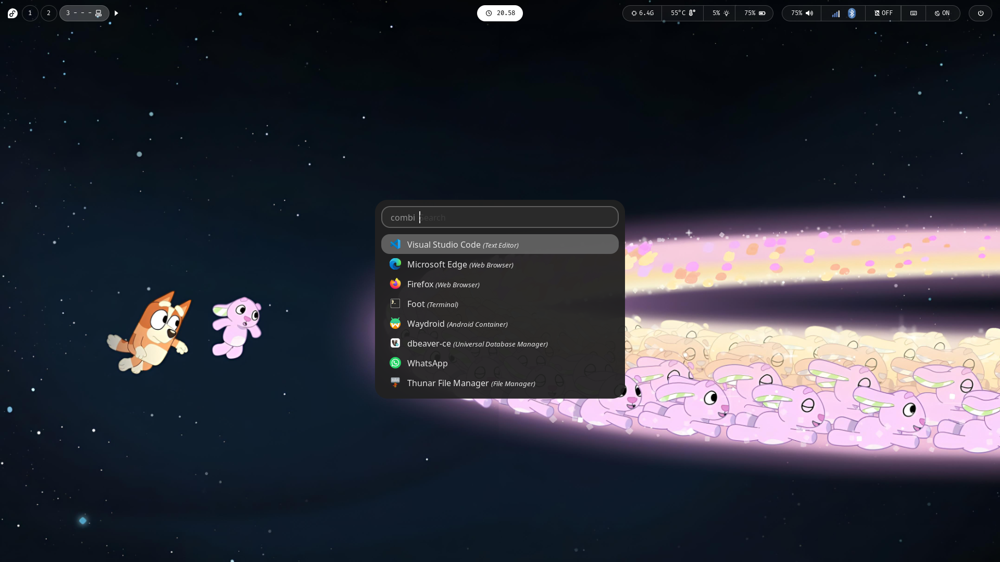

# My Ricing Fedora Sway

Minimal setup for daily use.



# Table of Contents
- [My Ricing Fedora Sway](#my-ricing-fedora-sway)
- [Table of Contents](#table-of-contents)
  - [Keybindings](#keybindings)
  - [Setting Battery Threshold](#setting-battery-threshold)
  - [Optimizing](#optimizing)
    - [Suspend](#suspend)
    - [Setup ZRAM](#setup-zram)
  - [Setup Virtual Keyboard](#setup-virtual-keyboard)
  - [Setup Waydroid](#setup-waydroid)
    - [Installation](#installation)
    - [Setup libndk for waydroid](#setup-libndk-for-waydroid)
    - [Why setup libndk?](#why-setup-libndk)
    - [Requirements](#requirements)
    - [1. Clone repo](#1-clone-repo)
    - [2. Create venv](#2-create-venv)
    - [3. In venv](#3-in-venv)
    - [4. Install dependency](#4-install-dependency)
    - [5. Run script](#5-run-script)

## Keybindings

| Keyboard | Action |
|----------|--------|
| `Super+Enter` | Open terminal |
| `Super+Shift+Q` | Close window |
| `Super+D` | Launcher |
| `XF86AudioRaiseVolume` | Increase volume (+5%) |
| `XF86AudioLowerVolume` | Decrease volume (-5%) |
| `XF86AudioMute` | Toggle mute |
| `XF86MonBrightnessUp` | Increase brightness (+2%) |
| `XF86MonBrightnessDown` | Decrease brightness (-2%) |
| `Mod+Tab` | Switch to next workspace |
| `Mod+Ctrl+Right` | Switch to next workspace |
| `Mod+Ctrl+Left` | Switch to previous workspace |
| `Mod+1..0` | Switch to workspace `1–10` |
| `Mod+Shift+1..0` | Move focused window to workspace `1–10` |
| `Print` | Screenshot selected area to clipboard |
| `Ctrl+Print` | Save screenshot to `~/Pictures/` |
| `Mod+F` | Toggle fullscreen |
| `Mod+Shift+Space` | Toggle floating mode |
| `Mod+B` | Horizontal split |
| `Mod+V` | Vertical split |
| `Mod+R` | Enter resize mode |
| `Resize Mode + Arrow` | Resize focused window |
| `Mod+M` | Enter move mode |
| `Move Mode + Arrow` | Move floating window |
| `Mod + Arrow` | Move focus |
| `Mod+Shift + Arrow` | Move focused window |

## Setting Battery Threshold

```sh
sudo nano /etc/systemd/system/battery-threshold.service
```

```
[Unit]
Description=Set battery charge threshold

[Service]
Type=oneshot
ExecStart=/bin/bash -c 'echo 40 > /sys/class/power_supply/BAT0/charge_control_start_threshold'
ExecStart=/bin/bash -c 'echo 80 > /sys/class/power_supply/BAT0/charge_control_end_threshold'

[Install]
WantedBy=multi-user.target
```

```
sudo systemctl enable --now battery-threshold.service
```

To check result configuration file:

```
cat /sys/class/power_supply/BAT0/charge_control_end_threshold
cat /sys/class/power_supply/BAT0/charge_control_start_threshold
```

## Optimizing

### Suspend

```sh
cat /sys/power/mem_sleep

# expected output: [s2idle]
```

```sh
sudo nano /etc/default/grub

# Add GRUB_CMDLINE_LINUX="mem_sleep_default=s2idle ..."
```

```sh
sudo grub2-mkconfig -o /boot/grub2/grub.cfg
```

Or if u use UEFI

```sh
sudo grub2-mkconfig -o /boot/efi/EFI/fedora/grub.cfg
```

### Setup ZRAM

``` sh
sudo nano /etc/systemd/zram-generator.conf
```

```ini
[zram0]
zram-size = ram * 1.5
compression-algorithm = zstd
```

## Setup Virtual Keyboard

```sh
git clone https://github.com/jjsullivan5196/wvkbd.git
```

```sh
sudo make install
```

## Setup Waydroid

### Installation

```sh
sudo dnf copr enable aleasto/waydroid -y && sudo dnf install waydroid -y
```

```sh
sudo waydroid init \
  -s GAPPS \
  -c https://ota.waydro.id/system \
  -v https://ota.waydro.id/vendor
```

### Setup libndk for waydroid

Some Android applications may fail to install from the Play Store or appear as "not compatible with your device" in Waydroid. This usually happens because certain apps depend on native Android libraries (NDK) that are not included by default.

Installing libndk improves compatibility by providing additional native library support required by some applications, allowing more apps to be installed and run properly in Waydroid.

### Why setup libndk?

By default, some Android apps rely on NDK (Native Development Kit) libraries for native code execution. Without these libraries, the Play Store may:

Prevent app installation
Mark apps as incompatible
Fail during installation
Cause apps to crash immediately after launch

Setting up libndk can help resolve these issues and increase application compatibility in Waydroid.

### Requirements

- python
- lzip

### 1. Clone repo

```sh
git clone https://github.com/casualsnek/waydroid_script
```

### 2. Create venv

```sh
python3 venv/venv
```

### 3. In venv

```sh
source venv/bin/activate
```

### 4. Install dependency

```sh
sudo pip install -r requirements.txt
```

### 5. Run script

```sh
sudo python3 main.py

# choose your android version
# choose libndk
```