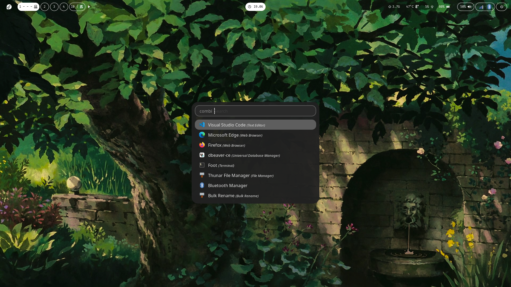

# My Ricing Fedora Sway

Minimal setup to daily use.



## Table of Contents
- [My Ricing Fedora Sway](#my-ricing-fedora-sway)
  - [Table of Contents](#table-of-contents)
    - [Keybindings](#keybindings)
    - [Setting Battery Threshold](#setting-battery-threshold)
    - [Optimizing](#optimizing)
      - [Suspend](#suspend)
      - [Setup ZRAM](#setup-zram)

### Keybindings

| Keyboard | Action |
|----------|--------|
| `Super+Enter` | Open terminal |
| `Super+Shift+Q` | Close window |
| `Super+D` | Launcher |
| `XF86AudioRaiseVolume` | Increase volume (+5%) |
| `XF86AudioLowerVolume` | Decrease volume (-5%) |
| `XF86AudioMute` | Toggle mute |
| `XF86MonBrightnessUp` | Increase brightness (+2%) |
| `XF86MonBrightnessDown` | Decrease brightness (-2%) |
| `Mod+Tab` | Switch to next workspace |
| `Mod+Ctrl+Right` | Switch to next workspace |
| `Mod+Ctrl+Left` | Switch to previous workspace |
| `Mod+1..0` | Switch to workspace `1–10` |
| `Mod+Shift+1..0` | Move focused window to workspace `1–10` |
| `Print` | Screenshot selected area to clipboard |
| `Ctrl+Print` | Save screenshot to `~/Pictures/` |
| `Mod+F` | Toggle fullscreen |
| `Mod+Shift+Space` | Toggle floating mode |
| `Mod+B` | Horizontal split |
| `Mod+V` | Vertical split |
| `Mod+R` | Enter resize mode |
| `Resize Mode + Arrow` | Resize focused window |
| `Mod+M` | Enter move mode |
| `Move Mode + Arrow` | Move floating window |
| `Mod + Arrow` | Move focus |
| `Mod+Shift + Arrow` | Move focused window |

### Setting Battery Threshold

```sh
sudo nano /etc/systemd/system/battery-threshold.service
```

```
[Unit]
Description=Set battery charge threshold

[Service]
Type=oneshot
ExecStart=/bin/bash -c 'echo 40 > /sys/class/power_supply/BAT0/charge_control_start_threshold'
ExecStart=/bin/bash -c 'echo 80 > /sys/class/power_supply/BAT0/charge_control_end_threshold'

[Install]
WantedBy=multi-user.target
```

```
sudo systemctl enable --now battery-threshold.service
```

To check result configuration file:

```
cat /sys/class/power_supply/BAT0/charge_control_end_threshold
cat /sys/class/power_supply/BAT0/charge_control_start_threshold
```

### Optimizing

#### Suspend

```sh
cat /sys/power/mem_sleep

# expected output: [s2idle]
```

```sh
sudo nano /etc/default/grub

# Add GRUB_CMDLINE_LINUX="mem_sleep_default=s2idle ..."
```

```sh
sudo grub2-mkconfig -o /boot/grub2/grub.cfg
```

Or if u use UEFI

```sh
sudo grub2-mkconfig -o /boot/efi/EFI/fedora/grub.cfg
```

#### Setup ZRAM

``` sh
sudo nano /etc/systemd/zram-generator.conf
```

```ini
[zram0]
zram-size = ram * 1.5
compression-algorithm = zstd
```

